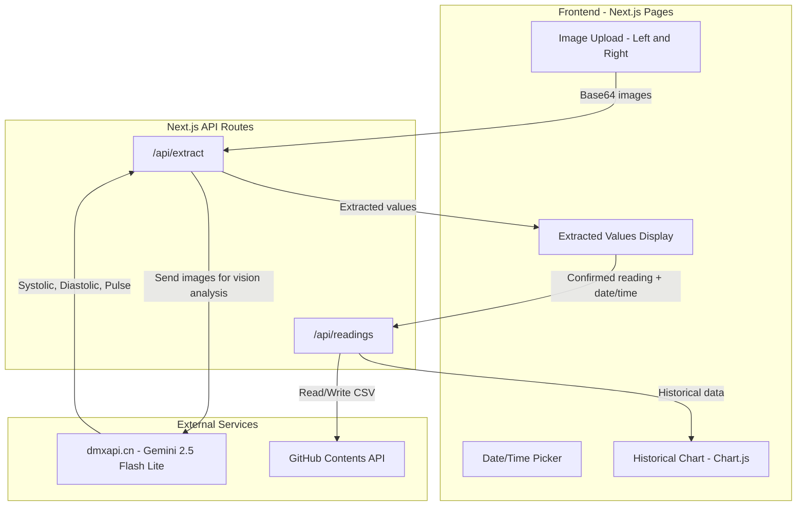

# Blood Pressure Tracker - Product Requirements Document

## Overview

A mobile-responsive web application for tracking blood pressure readings from both left and right arm cuffs. Users photograph their BP monitor displays, and AI extracts the readings automatically. Historical data is stored as a CSV in GitHub and visualized on an interactive chart.

---

## Tech Stack

- **Framework**: Next.js 14 (App Router) -- deployed to Vercel
- **Styling**: Tailwind CSS
- **Charts**: Chart.js with react-chartjs-2
- **AI API**: Gemini 2.5 Flash Lite via dmxapi.cn proxy (vision model for image extraction)
- **Storage**: CSV file committed to the GitHub repo via GitHub Contents API
- **Secrets**: `.env.local` (excluded from git)

---

## Architecture



---

## Features

### 1. Date and Time Selection

- Default to current date/time on page load
- Date picker (calendar dropdown) and time picker (HH:MM format)
- Selected datetime is attached to the reading when saved

### 2. Image Upload (Left and Right Hand)

- Two distinct upload zones: "Left Arm" and "Right Arm"
- Accept camera capture (mobile) and file upload (desktop)
- Image preview with option to retake/replace
- Images are converted to base64 before sending to the API
- Max file size: 5MB per image (compress client-side if needed)

### 3. AI Value Extraction

- Send uploaded image(s) to `/api/extract` endpoint
- API route proxies the request to `dmxapi.cn` using the Gemini vision model
- Prompt the model to extract: **Systolic (mmHg)**, **Diastolic (mmHg)**, **Pulse (bpm)**
- Display extracted values in editable fields so the user can correct if needed
- Each arm's image is processed independently

### 4. Historical Data Chart

- Line chart (Chart.js) with date/time on X-axis, pressure (mmHg) on Y-axis
- Four data series on the same chart:
  - Left Arm Systolic (solid line)
  - Left Arm Diastolic (dashed line)
  - Right Arm Systolic (solid line, different color)
  - Right Arm Diastolic (dashed line, different color)
- Optional: Pulse as a secondary Y-axis
- Tooltip showing full details on hover
- Filter by date range

### 5. Mobile-Responsive UI

- Mobile-first design using Tailwind CSS responsive utilities
- Single-column layout on mobile, two-column on desktop
- Touch-friendly inputs and buttons
- Camera capture integration on mobile devices (`accept="image/*" capture="environment"`)
- Bottom-anchored action buttons on mobile

### 6. CSV Storage in GitHub

- CSV file path: `data/readings.csv` in the repository
- CSV columns: `date,time,left_systolic,left_diastolic,left_pulse,right_systolic,right_diastolic,right_pulse`
- Read/write via GitHub Contents API (requires PAT)
- On save: fetch existing CSV, append new row, commit updated file
- On load: fetch CSV, parse, and return as JSON for the chart

---

## Environment Variables

File: `.env.local` (never committed to git)

```
AI_API_KEY=sk-8iyTYdXNBy0SmTVJQbMWp9RNimyQ0kZDrc7B5B2zcUS297Gn
AI_ENDPOINT=https://www.dmxapi.cn/v1/chat/completions
AI_MODEL=gemini-2.5-flash-lite

GITHUB_TOKEN=<your-github-personal-access-token>
GITHUB_REPO=<owner/repo-name>
GITHUB_CSV_PATH=data/readings.csv
```

On Vercel, these same variables are added via the Vercel dashboard (Settings > Environment Variables).

---

## Project Structure

```
Blood_preassure_monitor/
  app/
    layout.js          -- Root layout with Tailwind
    page.js            -- Main tracker page
    globals.css        -- Tailwind imports + custom styles
  api/
    extract/
      route.js         -- POST: send image to AI, return extracted values
    readings/
      route.js         -- GET: fetch CSV from GitHub; POST: append row to CSV
  components/
    DateTimePicker.js   -- Date and time selection component
    ImageUploader.js    -- Image upload with preview (used for each arm)
    ReadingForm.js      -- Extracted values display + edit + save
    BPChart.js          -- Historical chart component
    Header.js           -- App header
  lib/
    github.js           -- GitHub API helpers (read/write CSV)
    ai.js               -- AI API call helper
    csv.js              -- CSV parse/serialize utilities
  data/
    readings.csv        -- BP readings data (committed to repo)
  .env.local            -- Secrets (git-ignored)
  .env.example          -- Template showing required env vars (committed)
  .gitignore            -- Includes .env.local
  next.config.js
  tailwind.config.js
  package.json
```

---

## API Route Details

### POST `/api/extract`

**Request body:**
```json
{
  "image": "<base64-encoded-image>",
  "hand": "left" | "right"
}
```

**AI prompt strategy:**
> "You are analyzing a blood pressure monitor display image. Extract the systolic pressure (top/larger number in mmHg), diastolic pressure (bottom/smaller number in mmHg), and pulse rate (bpm). Return ONLY a JSON object: {\"systolic\": number, \"diastolic\": number, \"pulse\": number}. If you cannot read a value, use null."

**Response:**
```json
{
  "systolic": 120,
  "diastolic": 80,
  "pulse": 72
}
```

### GET `/api/readings`

Fetches `data/readings.csv` from GitHub, parses it, returns JSON array.

### POST `/api/readings`

**Request body:**
```json
{
  "date": "2026-03-31",
  "time": "14:30",
  "left_systolic": 120,
  "left_diastolic": 80,
  "left_pulse": 72,
  "right_systolic": 118,
  "right_diastolic": 78,
  "right_pulse": 70
}
```

Fetches existing CSV from GitHub, appends the new row, commits back via GitHub Contents API.

---

## UI Wireframe (Mobile Layout)

```
+----------------------------------+
|     Blood Pressure Tracker       |
+----------------------------------+
|  Date: [  2026-03-31  ]         |
|  Time: [  14:30       ]         |
+----------------------------------+
|  LEFT ARM        |  RIGHT ARM    |
|  [Upload Image]  |  [Upload Img] |
|  [  preview   ]  |  [ preview  ] |
+----------------------------------+
|  [  Extract Values  ]            |
+----------------------------------+
|  Left:  SYS 120 / DIA 80 / P 72 |
|  Right: SYS 118 / DIA 78 / P 70 |
|  [ Save Reading ]                |
+----------------------------------+
|  Historical Chart                |
|  [====line chart================]|
|  [============================] |
+----------------------------------+
```

---

## Deployment Checklist

1. Push code to GitHub (with `.env.local` in `.gitignore`)
2. Commit `.env.example` as a template
3. Connect repo to Vercel
4. Add all env variables in Vercel dashboard
5. Deploy -- Vercel auto-detects Next.js
6. Verify API routes work with Vercel's serverless functions
